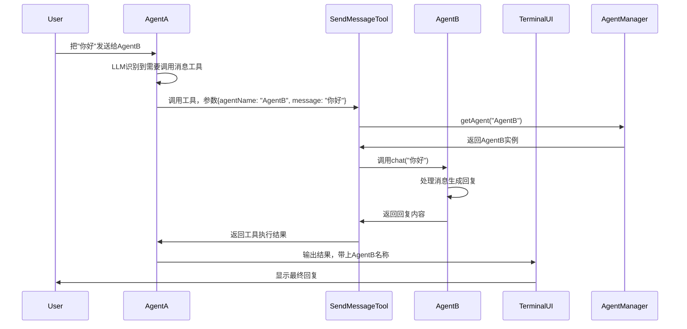

# LZY Agent CLI 技术架构文档

## 📋 技术栈
| 技术 | 用途 | 版本 |
|------|------|------|
| TypeScript | 开发语言 | ^5.0 |
| Node.js | 运行环境 | >=18.0 |
| @clack/prompts | 终端UI交互 | ^0.7 |
| OpenAI SDK | LLM接口对接 | ^4.0 |
| 智谱GLM-4 | 默认大模型 | 4-7-251222 |

---

## 🏛️ 整体架构设计
项目采用分层架构设计，各层职责清晰，低耦合高内聚：

```
┌─────────────────────────────────────────────────┐
│                     终端层                      │
│  TerminalUI / CommandExecuter / 交互逻辑        │
├─────────────────────────────────────────────────┤
│                     Agent层                     │
│  Base Agent / AgentLoop / 多Agent实例           │
├─────────────────────────────────────────────────┤
│                     核心层                      │
│  AgentManager / Memory / SkillManager / ToolManager │
├─────────────────────────────────────────────────┤
│                     工具层                      │
│  PowerShell / Bash / WebSearch / SendMessage    │
├─────────────────────────────────────────────────┤
│                     总线层                      │
│  EventBus / CommandBus / 消息通信               │
└─────────────────────────────────────────────────┘
```

### 设计原则
1. **单一职责**：每个模块只负责一件事
2. **依赖注入**：核心依赖通过构造函数注入，方便测试和扩展
3. **可扩展性**：技能、工具、Agent都可以方便扩展，不需要修改核心代码
4. **隔离性**：每个Agent拥有独立的记忆、技能和工具实例，互不影响
5. **约定优于配置**：技能、工具按约定目录放置，自动加载

---

## 🧩 核心模块详解

### 1. Agent层 (`src/agents/`)
#### Base Agent (`Agent.ts`)
所有Agent的基类，封装了Agent的核心能力：
```typescript
interface AgentConfig {
  name: string              // Agent唯一标识
  description: string       // Agent描述
  systemPrompt: string      // 系统提示词
  model: Model              // 模型配置
  memory: ShortTurnMemory   // 记忆实例
  skillManager: SkillManager // 技能管理器
  toolsManager: ToolsManager // 工具管理器
}
```
**核心方法**：
- `chat(input: string)`: 对话入口，接收用户输入，返回Agent回复
- `loadSkill(skillName: string)`: 加载指定技能
- `buildSystemPrompt()`: 构建最终系统提示词（基础提示+技能描述+工具描述）

#### AgentLoop (`agentLoop.ts`)
Agent思考循环核心，实现了工具调用、多轮思考的完整流程：
```
用户输入 → 加入记忆 → 调用LLM → 判断是否需要调用工具 → 执行工具 → 工具结果加入记忆 → 再次调用LLM → 循环直到得到最终回复 → 返回结果
```
**配置参数**：
- `maxTurns`: 最大思考轮次，防止无限循环
- `tools`: 可用工具列表
- `systemPrompt`: 系统提示词

---

### 2. 核心层 (`src/core/`)
#### AgentManager (`AgentManager.ts`)
全局单例，负责所有Agent的注册、管理和切换：
```typescript
class AgentManager {
  private agents: Map<string, Agent>  // Agent注册表
  public currentAgent: Agent | null   // 当前激活Agent
  
  registerAgent(agent: Agent): boolean  // 注册新Agent
  getAgent(name: string): Agent | undefined  // 获取指定Agent
  switchAgent(name: string): Agent  // 切换当前激活Agent
  getAgents(): { name: string; description: string }[]  // 获取所有Agent列表
}
```
**设计亮点**：
- 单例模式，全局唯一实例
- 支持动态注册/卸载Agent
- 提供事件订阅和命令响应能力

#### ShortTurnMemory (`ShortTurnMemory.ts`)
短期记忆管理器，支持持久化到本地文件：
```typescript
interface MemoryConfig {
  id: string               // 记忆唯一标识，作为持久化文件名
  persist: boolean         // 是否持久化到本地
  maxLength: number        // 最大记忆条数，超过自动截断
}
```
**核心能力**：
- 自动持久化：修改后自动写入本地JSON文件
- 自动截断：超过最大长度自动删除最早的记忆
- 类型安全：所有消息严格遵循TypeScript类型定义
- 隔离性：每个Agent拥有独立的记忆实例

#### SkillManager (`SkillManager.ts`)
技能管理器，自动扫描和加载技能：
```
扫描目录 → 解析SKILL.md文件 → 提取技能元数据和Prompt → 注册到技能库
```
**技能格式**：基于Markdown格式的SKILL.md文件，包含技能名称、描述、触发词、Prompt等信息，无需编写代码即可扩展技能。

#### ToolsManager (`ToolsManager.ts`)
工具管理器，统一管理所有系统工具：
```typescript
class ToolsManager {
  register(tool: AgentTool, definition: FunctionToolDefinition): ToolsManager  // 注册工具
  execute(toolName: string, args: Record<string, unknown>): Promise<any>  // 执行工具
  getToolDefinitions(): FunctionToolDefinition[]  // 获取工具定义，用于传给LLM
}
```

---

### 3. 工具层 (`src/tools/`)
所有工具都遵循统一的`AgentTool`接口：
```typescript
interface AgentTool {
  name: string                // 工具唯一名称
  description: string         // 工具描述，告诉LLM什么时候使用
  parameters: ToolParameter   // 参数定义，JSON Schema格式
  execute: (...args: any) => Promise<ToolResult>  // 执行逻辑
}
```

#### 内置工具列表
| 工具 | 用途 |
|------|------|
| PowerShellTool | 执行PowerShell命令，Windows系统专用 |
| BashTool | 执行Bash命令，Linux/macOS/WSL环境 |
| WebSearchTool | 网页搜索，获取实时信息 |
| SendMessageToAgentTool | Agent之间消息转发，实现多Agent协作 |

#### 工具扩展方式
1. 在`src/tools/`目录下新建工具文件，实现`AgentTool`接口
2. 在`src/index.ts`中注册工具：`toolsManager.register(YourTool, YourToolDefinition)`
3. 无需其他修改，所有Agent自动拥有这个工具的调用能力

---

### 4. 终端层 (`src/terminal/`)
#### TerminalUI (`TerminalUI.ts`)
终端交互核心，负责用户输入和输出渲染：
```typescript
class TerminalUI {
  constructor(options: {
    prompt?: string            // 自定义输入提示
    onInput?: (input: string) => Promise<any>  // 输入回调
  })
  
  print(message: string, prefix?: string): void  // 输出普通消息
  printError(message: string): void  // 输出错误消息
  printSuccess(message: string): void  // 输出成功消息
  printList(items: ListItem[], title?: string): void  // 输出列表
  async select<T>(options: SelectOption[], title?: string): Promise<T | null>  // 下拉选择
}
```

#### CommandExecuter (`CommandExecuter.ts`)
系统命令解析和执行，处理`/`开头的命令：
```
/help → 显示帮助
/exit → 退出程序
/clear → 清空会话
/agents → 查看Agent列表
/use <agent-name> → 切换Agent
/skills → 查看技能列表
/load <skill-name> → 加载技能
```

---

### 5. 总线层 (`src/bus/`)
#### EventBus (`EventBus.ts`)
发布订阅模式的事件总线，用于系统内跨模块通信：
```typescript
class EventBus {
  subscribe(eventName: string, handler: Function): void  // 订阅事件
  publish(eventName: string, data?: any): void  // 发布事件
}
```
**内置事件**：
- `event:app:exit`: 应用退出前触发
- `event:session:clear`: 会话清空时触发

#### CommandBus (`CommandBus.ts`)
请求响应模式的命令总线，用于需要返回结果的操作：
```typescript
class CommandBus {
  register(commandName: string, handler: Function): void  // 注册命令处理器
  invoke(commandName: string, args?: any): Promise<any>  // 调用命令
}
```
**内置命令**：
- `command:agent:list`: 获取Agent列表
- `command:agent:switch`: 切换Agent
- `command:skill:list`: 获取技能列表
- `command:skill:load`: 加载技能

---

## 🔑 关键实现原理

### 1. 多Agent通信实现
**核心逻辑**：
1. 基于`SendMessageToAgentTool`工具实现
2. Agent调用工具时传入目标Agent名称和消息内容
3. 工具通过`AgentManager`获取目标Agent实例
4. 调用目标Agent的`chat()`方法得到回复
5. 将回复返回给调用方Agent

**消息流转**：


### 2. 工具调用流程
```
1. Agent构建消息上下文，包含系统提示、历史消息、工具定义
2. 调用LLM，LLM根据用户问题判断是否需要调用工具
3. 如果需要调用工具，LLM返回工具调用指令（工具名+参数）
4. Agent解析工具调用指令，通过ToolsManager执行工具
5. 工具执行结果作为工具消息加入上下文
6. 再次调用LLM，让LLM根据工具结果生成最终回复
7. 循环直到LLM不需要调用工具，返回最终回复给用户
```

### 3. 技能系统实现
**核心设计**：技能完全基于Markdown文件，不需要编写代码
1. 技能文件格式为`SKILL.md`，包含YAML Front Matter和Prompt内容
2. 程序启动时自动扫描配置的技能目录
3. 解析SKILL.md文件，提取技能元数据（名称、描述、触发词等）
4. 用户触发技能时，将技能Prompt注入到Agent的系统提示中
5. Agent按照技能指定的方式响应用户问题

---

## 🚀 扩展开发指南

### 1. 新增Agent
```typescript
// 1. 创建独立的记忆实例
const myAgentMemory = new ShortTurnMemory({
  id: "my-agent",
  persist: true,
  maxLength: 100,
})

// 2. 创建Agent实例
const myAgent = new Agent({
  name: "my-agent",
  description: "我的自定义Agent",
  systemPrompt: "你是一个自定义Agent，专门处理XXX问题...",
  model: DEFAULT_MODEL,
  memory: myAgentMemory,
  skillManager,
  toolsManager,
})

// 3. 注册到AgentManager
agentManager.registerAgent(myAgent)
```

### 2. 新增工具
参考`src/tools/SendMessageToAgentTool.ts`实现：
1. 定义工具的FunctionToolDefinition（名称、描述、参数Schema）
2. 实现execute方法，处理工具逻辑
3. 在index.ts中注册工具

### 3. 新增技能
在技能目录下新建文件夹，创建`SKILL.md`文件：
```markdown
---
name: "我的技能"
description: "这是一个示例技能"
version: "1.0.0"
author: "your name"
trigger: ["示例", "技能"]
---

你现在是一个示例技能助手，需要按照以下规则回答用户问题：
1. 规则1...
2. 规则2...
```

---

## 📌 最佳实践
1. **Agent职责单一**：每个Agent专注于一个领域，不要做全能Agent
2. **系统提示精简**：系统提示词要简洁明确，不要包含无关信息
3. **工具描述精准**：工具的description要清晰告诉LLM什么时候应该使用这个工具
4. **记忆长度控制**：不要设置过大的maxLength，避免上下文超过模型Token限制
5. **错误处理完善**：工具执行要处理异常情况，返回友好的错误信息给LLM
